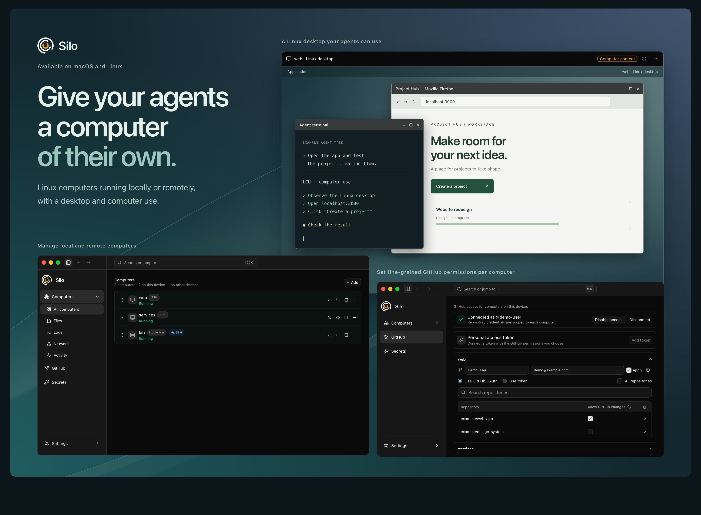

# Silo

Silo is a desktop app for running Linux sandboxes on your own computers. Each sandbox is a virtual machine powered by [MicroSandbox](https://github.com/superradcompany/microsandbox), with its own files, tools, and processes. Work locally on macOS or Linux, or connect to another computer over SSH.

Use your usual editor and terminal, give an AI agent a Linux desktop, and choose which repositories and credentials each sandbox can access.

[Download](https://github.com/0xpolarzero/silo/releases/latest) · [Website and demo](https://silo.polarzero.xyz) · [Build from source](docs/SiloUI-BUILD-FROM-SOURCE.md) · [Documentation](docs/README.md)



## What you can do

- **Work across computers.** Create, start, stop, and monitor local and remote sandboxes in one app.
- **Use familiar tools.** Open projects in your editor or terminal, browse files, and connect to development servers through local addresses.
- **Give agents a desktop.** Add an interactive Linux desktop with [Luda tools](docs/SiloUI-LUDA.md) for supported agents, including Codex, Claude Code, and Cursor. Install and sign in to the agents inside the sandbox yourself.
- **Control GitHub access.** Connect through OAuth and select repositories for each sandbox, with read-only access by default. Alternatively, use a [personal token](docs/SiloUI-GITHUB-PERSONAL-TOKENS.md), which grants the token's full permissions.
- **Scope API credentials.** Store credentials in your computer's credential store and choose the sandboxes and HTTPS domains that can use them. See [how secrets work](docs/SiloUI-SECRETS.md).
- **Back up and troubleshoot.** Export local sandbox disks, restore backups as new sandboxes, and search or export logs alongside activity history.

## Install

The VM runtime, base Linux image, and Git tools are bundled. Optional desktop packages download when you add a desktop.

| Platform | Requirements | Download |
| --- | --- | --- |
| macOS | Apple Silicon, macOS 14+ | [DMG](https://github.com/0xpolarzero/silo/releases/latest/download/Silo-macos-arm64.dmg) |
| Linux x86-64 | Ubuntu 24.04-compatible system | [DEB](https://github.com/0xpolarzero/silo/releases/latest/download/Silo-linux-x64.deb) · [AppImage](https://github.com/0xpolarzero/silo/releases/latest/download/Silo-linux-x64.AppImage) |
| Linux ARM64 | Ubuntu 24.04-compatible system | [DEB](https://github.com/0xpolarzero/silo/releases/latest/download/Silo-linux-arm64.deb) · [AppImage](https://github.com/0xpolarzero/silo/releases/latest/download/Silo-linux-arm64.AppImage) |

**macOS:** open the DMG and drag Silo to Applications. The app is not notarized; first launch may require **System Settings → Privacy & Security → Open Anyway**.

**Linux:** in the download directory, run `sudo apt install ./Silo-linux-x64.deb` (use `Silo-linux-arm64.deb` for ARM64). Accept the update-source prompt to receive releases through Software Updater. For AppImage, enable **Allow executing file as program** in its file properties, then launch it. Local VMs require KVM access; GitHub and secrets require a working Secret Service credential store, such as GNOME Keyring.

Upgrading an older installation? Read the [release notes](https://github.com/0xpolarzero/silo/releases/latest) for required migration steps.

## Start working

1. **Create a sandbox.** Follow setup to choose its name, CPU, memory, and disk size. GitHub is optional. Select **Linux desktop** if you want graphical apps or agent computer use. Use **Add → New sandbox** to create more later.
2. **Open your project.** Start the sandbox and open its terminal. Create or clone your project in `/workspace`; use HTTPS URLs for Silo's GitHub integration. In **Files**, open a folder in your preferred editor.
3. **Open a development server.** Run it inside the sandbox, listening on `0.0.0.0`. In **Network**, connect a discovered port or choose **Add port**, then open the displayed address on your computer.
4. **Open the desktop, if installed.** Choose **Open Linux desktop** from the sandbox's actions. You can add one later with **Add Linux desktop**. Closing the viewer leaves its graphical apps running.

Stopping a sandbox ends its running programs and preserves its files. Names and disk sizes are fixed after creation; changing CPU or memory stops the sandbox and applies on its next start. Quitting Silo stops local sandboxes; sandboxes on other computers keep running.

## Use another computer

Install Silo on both computers. You can connect during setup without creating a local sandbox.

1. On the computer that will run the VMs, enable SSH access (**Remote Login** on macOS). In **Settings → Computers**, enable **Allow remote management** and copy the address.
2. On your computer, choose **Add → Connect computer…**, paste the address, and follow the SSH setup prompts.
3. Use its sandboxes alongside your local ones. Choose **Run on** when creating a sandbox to select its computer.

Keep Silo running on the computer hosting the VMs. Manage its GitHub account, secrets, and backups there. See [remote computer setup](docs/SiloUI-REMOTE-COMPUTERS.md) for details.

## Develop Silo

The app uses React/TypeScript and Rust/Tauri in [`app/SiloUI`](app/SiloUI). Follow the [source-build guide](docs/SiloUI-BUILD-FROM-SOURCE.md) to install prerequisites and configure your own GitHub App, then run from the repository root:

```sh
npm --prefix app/SiloUI ci
npm --prefix app/SiloUI run desktop
```

For checks and release procedures, see the [development and release guide](docs/SiloUI-RELEASES.md). For the browser demo, see the [website README](website/README.md).

## Help and license

Check **Logs** and **Activity** for errors. [Report an issue](https://github.com/0xpolarzero/silo/issues) with your app version, OS, and reproduction steps; remove private data from shared logs.

Silo is [MIT licensed](LICENSE). Bundled dependencies have their own [licenses and notices](app/SiloUI/THIRD-PARTY-NOTICES.md).
