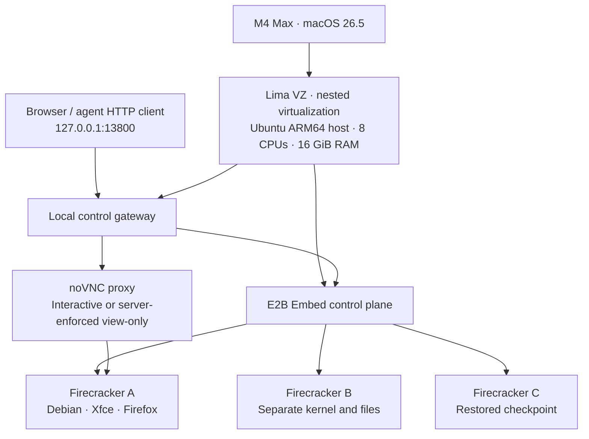

# Executed local E2B desktop PoC, 2026-09-22

The proposed nested ARM64 architecture works on the tested M4 Max. One Ubuntu
host VM ran three separate Firecracker desktop VMs. Agent GUI operations,
human takeover, memory-and-disk checkpoints, forks, pause/resume, controller
reconnection and recovery across a clean host shutdown all passed.

The implementation is in [experiments/e2b-local](../../experiments/e2b-local/README.md).
It provides a local browser control page and HTTP API, separately from Silo's
shipped Tauri backend. No production Silo runtime, user VM, Docker context or
cloud account was changed. This establishes feasibility, not a completed Silo
migration, a desktop/viewer ranking, or a production isolation guarantee.

## Tested architecture

- Physical Mac: M4 Max, 16 CPUs, 64 GiB RAM, macOS 26.5. M3 compatibility is
  documented upstream but was not tested on M3 hardware here.
- Host: Lima 2.2.0, Ubuntu 26.04 ARM64, Linux 7.0.0-28-generic, 4096-byte pages,
  working `/dev/kvm`, Docker 29.1.3 and Compose 2.40.3.
- Desktop: Debian bookworm, Xfce 4.18 session, X11/Xvfb, x11vnc, noVNC,
  Firefox ESR 140.16, Mousepad, Thunar and CJK fonts. Each VM is configured
  with 2 vCPUs and 2048 MiB RAM. No x86 emulation is involved.
- Desktop control uses E2B's Python Sandbox API plus screenshot/input helpers
  in this experiment. It does not install E2B Desktop's stock AMD64 recipe,
  Luda, or a new agent model/harness.
- The host has no shared Mac folders, forwarded SSH agent or imported SSH
  keys. Only the control gateway is forwarded to Mac loopback. VM data lives
  in `~/.silo-e2b-poc/lima/` under an experiment ownership marker.

## Observed behavior

The final automated acceptance run completed 14 checks in 18.09 seconds with
an already built template and running host. These are individual observations,
not latency distributions or cold-install timings.

| Check | Observation |
| --- | --- |
| Create two ARM64 desktops | 0.491 s and 0.216 s |
| Isolation | A's file and process absent in B; changing A's kernel hostname did not change B |
| Screenshot | Valid 1280 × 800 PNG; 0.121 s |
| Agent GUI editing | Click, clipboard-based Unicode typing and Ctrl+S produced the exact expected file; 1.326 s |
| Human takeover API | Agent input returned HTTP 409 while human control was active |
| Browser | Firefox opened the test page with its expected window title; 5.563 s |
| Private network probes | Guest connections to selected host/private endpoints were blocked; host-side positive health control succeeded |
| Guest metadata | Firecracker MMDS returned each guest's own sandbox ID |
| Checkpoint | Disk and live process memory captured in 2.371 s |
| Restore as a new desktop | 0.241 s; restored Python process retained its random nonce and counter 41, while source stayed at 99 |
| Files after restore | Restored file read `before`; source still read `after` |
| Pause/resume | Same desktop ID and process memory; 1.967 s |
| Gateway restart | Reconnected to existing desktop and memory; 0.865 s |

The browser interaction check used the real noVNC canvas after the host reboot.
Mousepad saved the original Unicode line plus `human typed this through novnc.`.
After returning control to the agent, the old viewer still had
`view_only=false` in its URL, but further typing and Save did not change the
file. This tests the server-side view-only route, beyond the browser checkbox.
Mode changes invalidate existing WebSockets. Agent operations and takeover are
serialized; takeover does not kill background work previously launched in the
guest.

The host recovery check captured two running Python processes, a notes file
and a SHA-256 digest of a 32 MiB random file in the second desktop. Shutdown
verified all three desktop IDs as paused and zero running Firecracker
processes. After a new Linux boot ID and E2B reconciliation, all three IDs
resumed; both process nonces/counters, the notes and the random-file digest
matched. This proves the tested **clean shutdown and recovery path**. It does
not prove recovery of unsaved running state after a power failure.

Eight unit tests passed for ownership, input handoff concurrency/persistence,
viewer route selection, cross-origin protection, lexical file-path bounds,
shell failure output and external pause state reconciliation. Python source
compilation passed. No Silo build was run because its application code was
unchanged.

## Measured resource cost

Measured with the three desktops running after recovery. Retained earlier
builds, failed experiments and checkpoints remain in this installation.

| Measurement | Observed value | Meaning |
| --- | ---: | --- |
| Outer VM RAM configuration | 16 GiB | Capacity assigned to the Linux host |
| Hugepage reservation | 8 GiB | Part of that host RAM, not additional RAM |
| Hugepages occupied | 2.81 GiB | 1441 of 4096 pages of 2 MiB at the observation |
| Host `MemAvailable` | 5.60 GiB | Linux estimate inside the outer VM |
| Idle desktop memory | 314 MiB | Guest `MemTotal − MemAvailable`; no browser opened in B |
| Browser/editor desktop memory | 808–844 MiB | Same guest calculation for A and restored C |
| Desktop filesystem used | 1.27–1.35 GiB | Includes installed applications and test files; not compressed image size |
| Host filesystem used | 27.72 GiB | Entire Linux installation, services, caches and retained state |
| E2B stored data | 18.44 GiB | Allocated bytes under `/var/lib/e2b`; a subset of host usage |
| Mac VM directory allocated | 28.33 GiB | Actual host allocation observed via `du`, not virtual capacity |
| Sparse disk capacity | 64 GiB | Maximum configured disk size |
| Mac tooling/downloads/evidence | 1.10 GiB | Additional files in the ignored verification directory |

The two new running desktops increased host filesystem allocation by about
482 MiB before their workloads. `/var/lib/e2b` alone did not show that increase:
active overlays and other runtime storage also matter. Subsequent snapshots,
pause/resume and writes grew the installation further. Do not interpret the
last allocation sample as a cost caused solely by its 32 MiB test write.

Shared templates avoid copying a complete desktop for every sandbox, but
retained snapshots and infrastructure are substantial. The data does not
establish that E2B consumes less total disk than Silo's current backend or
Bluefin. A desktop's 1.3 GiB installed filesystem and a full host deployment's
28.3 GiB allocation answer different questions.

## Failures found and corrected

1. **Build space:** Embed seeds a 512 MiB working-space quota, too small for
   desktop package installation. The dedicated experiment tier is raised to
   4096 MiB. The SDK's `min_free_disk_mb` applies after build steps and does not
   replace that quota.
2. **Clipboard command timeout:** `xclip` forked to own the clipboard while
   retaining command stdout/stderr. Redirecting those descriptors lets the
   SDK command finish while the clipboard remains available. The Unicode
   GUI/save assertion then passed.
3. **Browser readiness assertion:** Firefox's legacy `WM_NAME` was not the
   page title. Finding the window by class and reading its UTF-8 name fixed
   the probe. The earlier failure was not evidence of a Firefox cold-start
   defect. GUI commands also share an explicit desktop D-Bus address.
4. **Unsafe launcher shutdown:** The first launcher used an unprivileged
   file-existence test against a root-only registry directory. It skipped
   saving desktops, and the first host recovery test failed. The fixed helper
   runs as root, pauses desktops, stops the gateway to prevent a resume race,
   verifies paused states independently and rejects any remaining Firecracker
   process. Its refusal path was observed against stale records; the outer
   VM stayed running. Lost synthetic desktops were removed explicitly, then
   the full acceptance and host recovery checks passed with fresh desktops.
5. **Host boot reconciliation:** Docker service restarts alone do not rerun
   E2B's one-shot host setup. `up` now reconciles Compose after Lima starts,
   recreating ephemeral networking before desktop resumes.
6. **Durable VM location:** VM state was moved from temporary storage to a
   short persistent directory. The path check accounts for OpenSSH's temporary
   control-socket suffix as well as the final socket name.

## Reproduce and inspect

Follow the [runbook](../../experiments/e2b-local/README.md). The current control
page is `http://127.0.0.1:13800`. Test desktops remain available for inspection;
their one-hour runtime timeout is configured to pause, not kill. Use the
provided `stop` command for an orderly host shutdown.

Generated evidence is intentionally ignored under
`app/SiloUI/src-tauri/target/verification/e2b-local/`:

- `evidence/acceptance.json`, `evidence/desktop.png`, `evidence/browser.png`,
  and `evidence/human-handoff.png`.
- `evidence/host-restart.json`, `evidence/resources.json`, and
  `evidence/mac-disk.json`.
- `acceptance-final.log`, `host-stop-fixed-success.log`,
  `host-start-fixed-success.log`, and `host-restart-final.log`.
- Earlier failed reports/logs are retained separately; they were not rewritten
  as passing evidence. SDK credentials and private state are not collected.

Remaining qualification is specific: integration with Silo's Tauri/WebKit
viewer and lifecycle, remote hosts, actual M3 hardware, workload/capacity and
streaming latency tests, forced-crash recovery, checkpoint retention/export,
agent task-completion comparison and security review. This PoC has a loopback
API that trusts local users, not multi-user authentication. Its private IPv4
probes are not a hostile-guest security assessment; public egress is allowed.
Snapshots do not undo external actions, make arbitrary databases consistent,
or protect against losing the host disk.

## Primary sources and pins

- [E2B Embed Compose requirements and host setup](https://github.com/e2b-dev/runtime/blob/a065a4ddb3f2c6a4149634d9acb14b62f65839ac/embed/compose/README.md): evaluation status, ARM64 kernel/page requirements, M3+/macOS 15+ route, hugepages and reconciliation.
- [Pinned Compose definition](https://github.com/e2b-dev/runtime/blob/a065a4ddb3f2c6a4149634d9acb14b62f65839ac/embed/compose/compose.yaml) and its `.env` are checksum verified by the launcher.
- [Separate template build-space inputs](https://github.com/e2b-dev/runtime/blob/a065a4ddb3f2c6a4149634d9acb14b62f65839ac/packages/api/internal/handlers/template_start_build_v2.go).
- [E2B snapshot semantics](https://docs.e2b.dev/sandbox/snapshots) and [persistence](https://docs.e2b.dev/sandbox/persistence).
- [Stock desktop recipe](https://github.com/e2b-dev/desktop/blob/17ddc44f31080af9f2d0fa0fa767525fefd9882c/template/template.py), used as prior art rather than copied unchanged.
- [Lima VZ configuration](https://lima-vm.io/docs/config/vmtype/vz/) and [Apple nested virtualization capability](https://developer.apple.com/documentation/virtualization/vzgenericplatformconfiguration/isnestedvirtualizationsupported).

The launcher pins Lima, the Ubuntu host image and E2B's Compose source. Python
direct dependencies are pinned. Debian's base-image tag and package channels
still move; this is not a bit-for-bit build lockfile.
